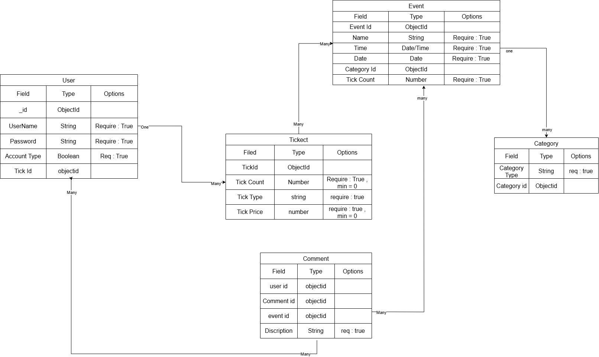
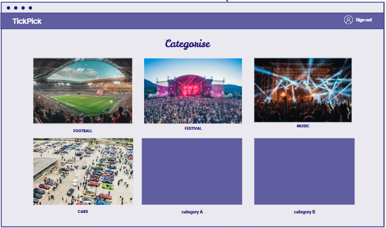
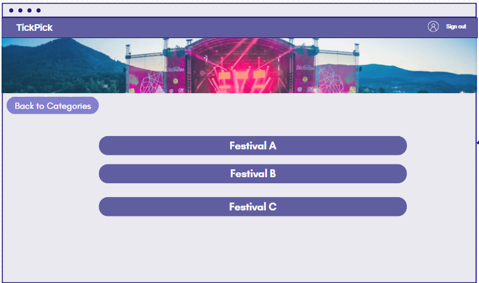
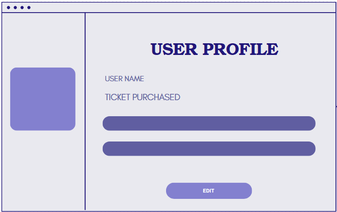

# TickPick

## Background

- TickPick is a web-based event ticketing system designed to simplify the process of purchasing and managing event tickets. Built using Node.js, the platform provides users with an intuitive interface to browse, select, and purchase tickets for various events.

## User Stories

- As a user i want to sign in to my account.
- As a user i want to create a new account, i can manage my bookings.
- As a user i want to choose one of the category events.
- As a user i want to view the list of events.
- As a user i want to view event details.
- As a user i can buy a tickets.
- As a user i can add a comment in the comment section.
- As a user i can edit my profile.

## Entity relationship diagrams (ERD)

Entity relationship diagrams (ERDs) are a way to describe the data that will be used in an application. Using the user stories we created above, we know we must keep track of users and listings. Before considering the relationships between users and listings, let's consider what data we need to keep track of for each resource.

**For users, we need to keep track of:**

1. Username - String and is required
2. Password - String and is required
3. Account type - boolean and is required

**For Event, we need to keep track of:**

1. Name - String and is required
2. Time and Date - Date and is required
3. Tick Count - Number, minimum of 0, and is required

**For Ticket, we need to keep track of:**

1. Tick Count - Number, minimum of 0, and is required
2. Tick Type - String and is required
3. Tick Price - Number, minimum of 0, and is required

**For Comments, we need to keep track of:**

1. Description - String and is required

**For Category, we need to keep track of:**

1. Category Type - String and is required

# wireframes

**First page:**

**Second page:**

_if the user sign in or sign up it will sow to the user this page:_

**Sign up:**

_To Create new account page:_

> Note: if the user click on sign up it will show the user this page.

**Sign in:**

> Note: if the user click on sign in it will show the user this page.

**Third page:**

_After the user click on categories button it will show to the user this page:_

**List of the events:**

_After the user select on one of the categories it will show to the user this page:_

**Information of the events:**

_After the user select on of the events it will show to the user this page:_

> Note: the user can buy the ticket from this page.

**Profile page:**

> Note: if the user click on edit button it will allow the user to edit the details.
